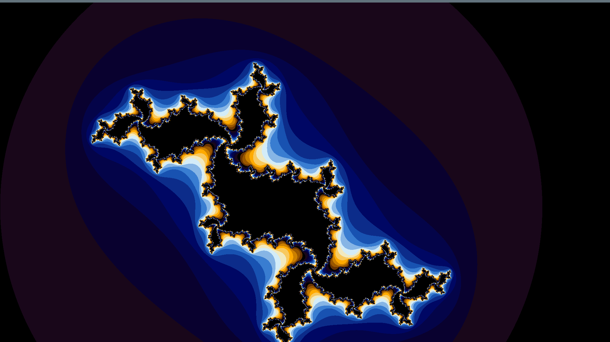
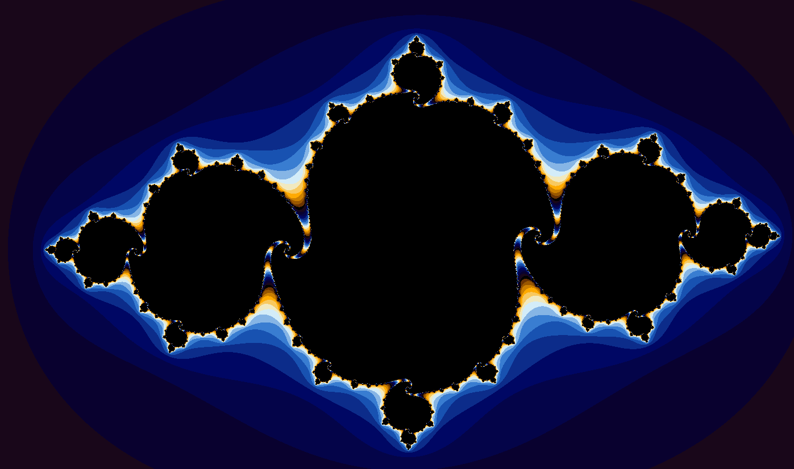

# Julia Set Animation

Julia set animation made in unity using compute shaders. It cycles through various Julia Set's for c equal to 0.786e^(it), where t changes from 0 to 2π. It makes essentially looped animation.

The algorithm I used can be found on wikipedia: https://en.wikipedia.org/wiki/Julia_set

The code and colouring is modified version of Coderious's Mandelbrot script: https://github.com/Coderious-GitHub/MandelbrotCS

## Possible improvements:
  * Adding UI to input custom values.
  * Adding speed slider.
  * Fixing gray band on top of the display.
 

